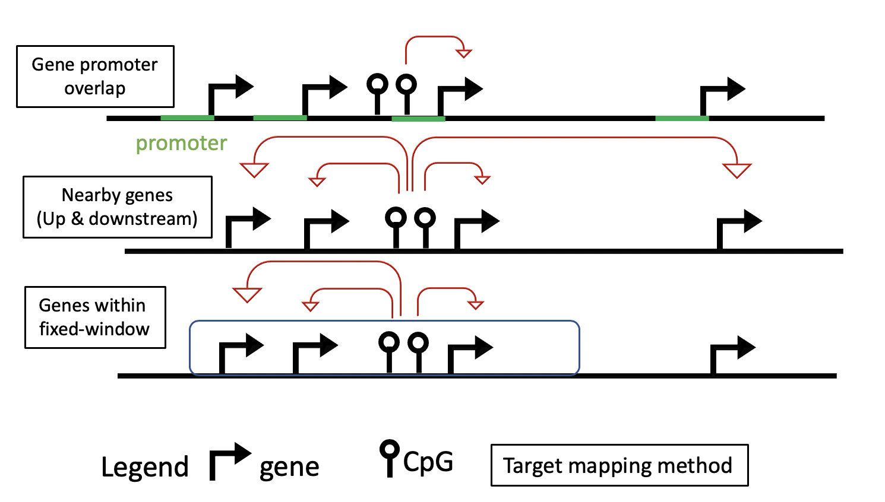

  
<style> body {text-align: justify} </style>
  
```{r settings, include = FALSE}
knitr::opts_chunk$set(collapse = TRUE, comment = "#>")
library(dplyr)
library(sesameData)
sesameDataCacheAll()
```

# 1. Introduction

Transcription factors (TFs) are proteins that facilitate the transcription of 
DNA into RNA. A number of recent studies have observed that the binding of TFs 
onto DNA can be affected by DNA methylation, and in turn, DNA methylation can 
also be added or removed by proteins associated with transcription 
factors [@bonder2017disease; @banovich2014methylation; @zhu2016transcription].

To provide functional annotations for differentially methylated regions (DMRs) 
and differentially methylated CpG sites (DMS), `coMethTF` performs integrative 
analyses using matched DNA methylation and gene expression along with 
Transcription Factor Binding Sites (TFBS) data. coMethTF evaluates, prioritizes 
and annotates DNA methylation regions (or sites) with high regulatory potential 
that works synergistically with TFs to regulate target gene expressions, 
without any additional ChIP-seq data. 

The results from `coMethTF` can be used to generate testable hypothesis on the 
synergistic collaboration of DNA methylation changes and TFs in gene regulation.
`coMethTF` can be used either to evaluate regulatory potentials of candidate 
regions or to search for methylation coupled TF regulatory processes in the entire genome.

# 2. Installation 

You can install the development version of the package from GitHub using the following code:

```{r, eval = FALSE}
devtools::install_github("TransBioInfoLab/coMethTF")
```

```{r libs_load, eval = TRUE, include = FALSE}
library(coMethTF)
```

After the package is successfully installed you can load its functions with:

```{r setup, eval = FALSE}
library(coMethTF)
```

# 3. Dataset

The input of `coMethTF` are DNA methylation and gene expression datasets measured 
on the same set of samples. Using additional information from the 
JASPAR2000 database, we will then create a data frame 
with information on the triplet: CpG (or DMR), TF and target gene. 

For illustration, we will use chromosome 21 data from 38 TCGA-COAD (colon cancer) samples.

## 3.1 Input DNA methylation dataset

The DNA methylation dataset is a matrix with methylation beta or M-values. 
If there are potential confounding factors (e.g. batch effect, age, sex) in the dataset, this matrix would contain residuals from fitting linear regression 
instead (see details **Section 7** "Controlling effects from confounding variables" below). 

The samples are in the columns and methylation regions or probes are in the rows.   

### 3.1.1 Analysis for individual CpGs data

We will analyze all CpGs on chromosome 21 in this vignette. 

However, oftentimes, the methylation data can also be, for example, **differentially methylated sites** (DMS) or **differentially methylated regions** (DMRs) obtained in an epigenome-wide association study (EWAS) study.

```{R warning=FALSE}
dna.met.chr21 <- get(data("dna.met.chr21"))
```

```{R}
dna.met.chr21[1:5,1:5]
```

We will first create a SummarizedExperiment object with the function
`make_se_from_dnam_probes`. This function will use the Sesame package to map the array
probes into genomic regions.

```{R}
dna.met.chr21.se <- make_se_from_dnam_probes(
  dnam = dna.met.chr21,
  genome = "hg38",
  arrayType = "450k"
)
```


```{R}
dna.met.chr21.se
SummarizedExperiment::rowRanges(dna.met.chr21.se)[1:4,1:4]
```


### 3.1.2 Analysis of DMRs

Differentially Methylated Regions (DMRs) associated with phenotypes such as tumor stage can be obtained from R packages such as `coMethDMR`, `comb-p`, `DMRcate` and many others. The methylation levels in multiple CpGs within the DMRs need to be 
summarized (e.g. using medians), then the analysis for DMR will proceed in the same way 
as those for CpGs. See **Section 6** "Identifying co-methylated clusters and summarizing regions using medians for DMRs" below for more details.   


## 3.2 Input gene expression dataset

The gene expression dataset is a matrix with log2 transformed and normalized gene expression values. 
If there are potential confounding factors (e.g. batch effect, age, sex) in the dataset, 
this matrix can also contain residuals from linear regression instead (see **Section 7** "Controlling effects from confounding variables" below).

The samples are in the columns and the genes are in the rows. 

```{R}
gene.exp.chr21 <- get(data("gene.exp.chr21.log2", package = "coMethTF"))
gene.exp.chr21[1:5,1:5]
```

We will also create a SummarizedExperiment object for the gene expression data.
This object will contain the genomic information for each gene.

```{R}
gene.exp.chr21.se <- make_se_from_gene_matrix(gene.exp.chr21)
gene.exp.chr21.se
SummarizedExperiment::rowRanges(gene.exp.chr21.se)[1:5,]
```

```{R, include = FALSE, results = "hide"}
rm(dna.met.chr21)
rm(gene.exp.chr21)
gc()
```

## 3.3 Creating triplet dataset

To create the triplet dataset of CpGs, target genes and TFs, we first link each CpG with target gene (_CpG region-target gene_ dataset). Next, we link each CpG with TFs that have binding sites nearby (_CpG region-TF_ dataset). Finally, we merge the two datasets by CpGs. 

### Mapping Regions to the target gene

In this section, **regions** refer to the regions where CpGs are located. The function `get_region_target_gene` provides three different methods to link a region to a target gene: 

1. Mapping the region to the closest gene (`method = "genes.promoter.overlap"`)
2. Mapping the region to a specific number of genes upstream down/upstream of the region (`method = "nearby.genes"`) [@silva2019elmer].
3. Mapping the region to all the genes within a window 
(default size = 500 kbp around the region, i.e. +- 250 kbp from start or end of the region) (`method = "window"`) [@reese2019epigenome].




For the analysis of probes in promoter regions, we recommend setting `method = "genes.promoter.overlap"`.
For the analysis of probes in distal regions, we recommend setting either `method = "window"` or `method = "nearby.genes"`. 
Note that the distal analysis will be more time and resource consuming. 

As an example, the following scripts link CpGs with the nearest gene (method 1. above)

```{R}
# Get CpG information
probes.gr <- SummarizedExperiment::rowRanges(dna.met.chr21.se)
class(probes.gr)
```

```{R}
# Map probes to nearest gene
region.target.closest <- get_region_target_gene(
    regions.gr = probes.gr, 
    genome = "hg38", 
    method = "genes.promoter.overlap",
    promoter.upstream.dist.tss = 2000,
    promoter.downstream.dist.tss = 2000
)
dim(region.target.closest)
region.target.closest
```

Alternatively, we can also link each probe with genes within 500 kb window (method 2). 
```{R}
# Map probes to genes within 500kb window
region.target.window <- get_region_target_gene(
    regions.gr = probes.gr, 
    genome = "hg38", 
    method = "window",
    window.size = 500 * 10^3,
    rm.promoter.regions.from.distal.linking = TRUE,
    promoter.upstream.dist.tss = 2000,
    promoter.downstream.dist.tss = 2000
)

dim(region.target.window)
region.target.window
```

For method 3, to map probes to 5 nearest upstream and downstream genes:  

```{R}
# Map probes to 5 genes upstream and 5 downstream
region.target.nearby.genes <- get_region_target_gene(
    regions.gr = probes.gr, 
    genome = "hg38", 
    method = "nearby.genes",
    num.flanking.genes = 5,
    rm.promoter.regions.from.distal.linking = TRUE,
    promoter.upstream.dist.tss = 2000,
    promoter.downstream.dist.tss = 2000
)

dim(region.target.window)
region.target.window
```

### Mapping Regions to TF

In this section, **regions** refer to the regions where CpGs are located. The function `get_tf_in_region` uses `motifmatchr` [@motifmatchr] to scan these regions for occurrences of motifs in the JASPAR database.

JASPAR 2020 is an open-access database of curated, non-redundant transcription 
factor (TF)-binding profiles [@JASPAR2020; @fornes2020jaspar], which contains 
more the 500 human TF motifs.

The argument `window.size` will be used to extend the region when scanning
for the motifs, for example, a `window.size` of `50` will add `25` bp 
upstream and `25` bp downstream of the original region.

```{R, results = "hide"}
region.tf <- get_tf_in_region(
    region = probes.gr, 
    genome = "hg38", 
    window.size = 50,
    p.cutoff = 5e-5
)
```

```{R}
head(region.tf)
dim(region.tf)
```

```{R, include = FALSE, results = "hide"}
rm(probes.gr)
gc()
```


### Triplet data frame – matching DMR (or CpGs) with TFs and target genes

We create the triplet dataset by merging the _CpG region-target gene_ dataset and the _CpG region-TF_ dataset. 

```{R, message = FALSE, warning = FALSE}
# Merging the results from the previous sections (region and target, and region and TF)
triplet <- dplyr::inner_join(region.target.closest, region.tf)
```

```{R}
# Since our data has only chr21 we will only keep TFs on chr21.
triplet <- triplet[triplet$TF %in% rownames(gene.exp.chr21.se),]
```

The triplet is a data frame with the following columns:

* `target`: gene identifier (obtained from row names of the gene expression matrix),
* `regionID`: region/CpG identifier (obtained from row names of the DNA methylation matrix)
* `TF`: gene identifier (obtained from the row names of the gene expression matrix)


```{R}
head(triplet)
```

Note that there may be multiple rows for a CpG region, when multiple target gene and/or TFs are found close to it. 

# 4. Evaluating the regulatory potential of CpGs (or DMRs) 

Because TF binding to DNA can be influenced by (or influences) DNA methylation levels nearby [@yin2017impact], 
target gene expression levels are often resulted from the synergistic effects of both TF and DNA methylation. In other words, TF activities in gene regulation is often affected by DNA methylation. 

Our goal then is to highlight DNA methylation regions (or CpGs) where these synergistic DNAm and TF collaborations occur. 
We will perform analyses using the 3 datasets described above in Section 3:

* An input DNA methylation matrix
* An input Gene expression matrix
* The created triplet data frame with expression values for DNA methylation region, TF, and target gene

## 4.1 Analysis using model with methylation by TF interaction

The function `interaction_model` assess the regulatory impact of DNA methylation on TF regulation of target genes via two approaches: 

**Model 1** (considering DNAm values as a continuous variable) - we fit a model with TF by DNA methylation interaction using all samples.

$$log_2(RNA target)  \sim log_2(TF) + DNAm + log_2(TF) * DNAm$$
**_Interpretation_ :**    Note that Model 1 partitions the effects of DNA methylation and TF on target gene expressions into three categories: 

* `log_2(TF)` - models direct effect of TF on target gene expression; 
* `DNAm` - models direct effect of DNA methylation on target gene expression; 
* `log_2(TF) × DNAm` interaction term - models synergistic effect of TF and DNA methylation, that is, how effect of TF on target gene expression is modified by DNA methylation. 

To identify the cases where DNAm collaborate with TFs to influence gene expression, we're typically interested in those triplets with significant `log_2(TF) × DNAm` interaction term, although the cases for which `log_2(TF)` or `DNAm` are significant can also be interesting.     

**Model 2** (considering DNAm values as a binary variable) - we define a binary variable 
`DNAm Group` for DNA methylation values (high = 1, low = 0). That is, samples with the 
highest DNAm levels (top 25 percent) has high = 1, samples with lowest DNAm levels (bottom 25 pecent) has high = 0.  

Note that in this implementation, only samples with DNAm values in the first and last quartiles are considered.

$$log_2(RNA target) \sim log_2(TF) + \text{DNAm Group} + log_2(TF) * \text{DNAm Group}$$
 
```{R, message = FALSE, results = "hide", include = FALSE}
results.interaction.model <- interaction_model(
    triplet = triplet,
    dnam = dna.met.chr21.se[rownames(dna.met.chr21.se) %in% triplet$regionID,],
    exp = gene.exp.chr21.se[rownames(gene.exp.chr21.se) %in% c(triplet$target,triplet$TF),]
)
```

 
```{R interaction_model, message = FALSE, results = "hide", eval = FALSE}
results.interaction.model <- interaction_model(
    triplet = triplet, 
    dnam = dna.met.chr21.se,
    exp = gene.exp.chr21.se
)
```

The output of `interaction_model` function will be a data frame with the following variables:

* `pval_<variable>`: p-value for a tested variable (methylation or TF), given the other variables included in the model.
* `estimate_<variable>`: estimated effect for a variable. If estimate > 0, increasing values 
of the variable corresponds to increased outcome values (target gene expression). 
If estimate < 0, increasing values of the variable correspond to decreased target gene expression levels.


The following columns are provided for the results of fitting **Model 1** to triplet data:

* `pval_met`: p-value for DNA methylation variable
* `pval_rna.tf` : p-value for TF expression
* `pval_met.rna.tf`: : p-value for DNA methylation by  TF interaction
* `estimate_met`: estimate for DNA methylation variable
* `estimate_rna.tf`: estimate  for TF expression
* `estimate_met.rna.tf`: estimate for DNA methylation by  TF interaction

```{R interaction_model_results}
dim(results.interaction.model)
colnames(results.interaction.model)

# Results for full model (with all samples)
results.interaction.model %>% dplyr::select(
    c(1,4,5,grep("quant",colnames(results.interaction.model),invert = TRUE))
    ) %>% head
```


The following columns are provided for the results of fitting **Model 2** (quartile model) to triplet data:

* `quant_pval_metGrp`: p-value for DNA methylation variable
* `quant_pval_rna.tf` : p-value for TF expression
* `quant_pval_metGrp:rna.tf`: : p-value for DNA methylation by  TF interaction
* `quant_estimates_metGrp`: estimate for DNA methylation variable
* `quant_estimates_rna.tf`: estimate  for TF expression
* `quant_estimates_metGrp:rna.tf`: estimate for DNA methylation by  TF interaction


```{R}
# Results for quartile model
results.interaction.model %>% dplyr::select(
  c(1,4,5,grep("quant",colnames(results.interaction.model)))
  ) %>% head
```

To select significant DNAm by TF interaction from both models, you can subset the results
using the p-value from each linear model.

```{r, include = TRUE, eval = TRUE}
results.sig <- results.interaction.model %>% 
  dplyr::filter(Max_interaction_pval < 0.05)
```

```{R}
head(results.sig)
```

## 4.2 Stratified analysis by high and low DNA methylation levels

For triplets with significant `log_2(TF) × DNAm` interaction effect identified above, we can further assess how gene regulation by TF changes when DNAm is high or low. To this end, the function 
`stratified_model` fits two separate models (see below) to only 
samples with the highest DNAm levels (top 25 percent), and then to only samples with 
lowest DNAm levels (bottom 25 percent), separately.

$$\text{Stratified Model: } log_2(RNA target) \sim log_2(TF)$$

```{R, message = FALSE, results = "hide", include = FALSE}
results.stratified.model <- stratified_model(
    triplet = triplet,
    dnam = dna.met.chr21.se[rownames(dna.met.chr21.se) %in% triplet$regionID,],
    exp = gene.exp.chr21.se[rownames(gene.exp.chr21.se) %in% c(triplet$target,triplet$TF),]
)
```

```{R stratified_model, message = FALSE, results = "hide", eval = FALSE}
results.stratified.model <- stratified_model(
    triplet = triplet,
    dnam = dna.met.chr21.se,
    exp = gene.exp.chr21.se
)
```

```{R}
results.stratified.model %>% head
```

## 4.3 Visualization of data  

The functions `plot_interaction_model` and  `plot_stratified_model` 
will create figures to visualize the data, 
in a way that corresponds to the linear model we considered above. 
It requires the output from the function `interaction_model`/`stratified_model` (a dataframe),
the DNA methylation matrix and the gene expression matrix as input. 


```{R plot_interaction_model, eval = TRUE, message = FALSE, results = "hide", warning = FALSE}
plots <- plot_interaction_model(
    triplet.results = results.interaction.model, 
    dnam = dna.met.chr21.se, 
    exp = gene.exp.chr21.se
)
```

```{R, fig.height = 14, fig.width = 14, eval = TRUE}
plots[[29]]
```


```{R plot_stratified_model, eval=TRUE, message=FALSE, results="hide", warning=FALSE}
plots <- plot_stratified_model(
    triplet.results = results.stratified.model, 
    dnam = dna.met.chr21.se, 
    exp = gene.exp.chr21.se
)
```

```{R, fig.height = 14, fig.width = 14, eval = TRUE}
plots[[29]]
```

The first row of the figures shows pairwise associations between DNA methylation, 
TF and target gene expression levels. 

The second row of the figures show how much TF activity on target 
gene expression levels vary by DNA methylation levels. When TF by methylation 
interaction is significant (Section 4.1), we expect the association between TF 
and target gene expression vary depending on whether DNA methylation is low or high. 

In this example, when DNA methylation is low, target gene expression is relatively independent of the amount of TF available. On the other hand, when DNA methylation 
level is high, more abundant TF corresponds to increased gene expression (an activator TF). 
One possibility is that DNA methylation might enhance TF binding in this case. 
_**This is an example where DNA methylation and TF work synergistically to affect target gene expression**_. 

While the main goal of coMethTF is to prioritize methylation CpGs, also note that without stratifying by DNA methylation, the overall TF-target effects (p = 0.142) is not as significant as the association in stratified analysis in high methylation samples (p = 0.00508). _**This demonstrates that by additionally modeling DNA methylation, we can also nominate TF – target associations that might have been missed otherwise**_. 

If you want to highlight different group of samples, you can also use the `metadata` argument
with a dataframe where rownames are the samples (same order as the columns of the 
DNAm and gene expression), and the columns highlight the groups. Here is an example: 

```{R, message = TRUE, results = "hide",eval = FALSE}
data("clinical")
metadata <- clinical[,c("sample_type"),drop = FALSE]
```


```{R eval=FALSE, message=FALSE, warning=FALSE, results="hide"}
plots <- plot_stratified_model(
        triplet.results = results.stratified.model[29 ,], 
        dnam = dna.met.chr21.se, 
        exp = gene.exp.chr21.se,
        metadata = metadata
)
```


```{R, fig.height = 14, fig.width = 14, eval = FALSE}
plots[[1]]
```

# 5. Results interpretation

Shown below are some expected results from fitting Models 1 & 2 described in 
**Section 4.1** above, depending on TF binding preferences. Please note that 
there can be more possible scenarios than those listed here, therefore, 
careful evaluation of the statistical models and visualization of data as 
described in **Section 4** are needed to gain a good understanding of the 
multi-omics data. 


# 6. Identifying co-methylated clusters of CpGs in DMRs and summarizing regions with multiple CpGs

Given regions for DMRs, the R package [coMethDMR](https://github.com/TransBioInfoLab/coMethDMR) 
can be used to identify co-methylated regions [@gomez2019comethdmr]. 
To install it, please use the following command:

```{R, eval = FALSE}
devtools::install_github("TransBioInfoLab/coMethDMR")
```

We can then summarize methylation levels from multiple CpGs within each region using median. 

```{r, eval = FALSE, include = TRUE, message = FALSE, results = "hide"}
library(coMethDMR)
library(dplyr)
```

For illustration, we will use probe clusters in predefined genomic regions 
from the `coMethDMR` R package here. 

```{R cluster_probes, eval = FALSE}
probes.cluster <- coMethDMR::getPredefinedCluster(
  arrayType = "450k",
  clusterType = "regions"
)
```

```{R, eval = FALSE}
message("Number of clusters: ",length(probes.cluster))
probes.cluster %>% head
```

For real data analysis, please replace `probes.cluster` with probes in DMRs 
identified in epigenome-wide association study. The  `coMethDMR::GetCpGsInAllRegion` 
function can be used to extract probes within the DMRs. 

Here are the sample scripts for this task:   
```{r, eval = FALSE}
probes.cluster <- coMethDMR::GetCpGsInAllRegion(
    regionName_char = c("chr21:37432493-37432782",
                        "chr21:18884682-18885210", 
                        "chr21:27107799-27107982"),
      arrayType = "450k"
)
probes.cluster
```

Next we find co-methylated regions within the DMRs.
```{R cometh, eval = FALSE}
data("dna.met.chr21")
# only keep DNAm values for the probes obtained above
dna.met.chr21 <- dna.met.chr21[rownames(dna.met.chr21) %in% unique(unlist(probes.cluster)),]
```

```{R,eval = FALSE}
coMeth_ls <- coMethDMR::CoMethAllRegions(
    dnam = dna.met.chr21,
    betaToM = TRUE,
    method = "spearman",
    minPairwiseCorr = 0.2,
    CpGs_ls = probes.cluster,
    arrayType = "450k",
    returnAllCpGs = FALSE,
    output = "CpGs",
    nCores_int = 1
)
```


```{R, eval = FALSE}
message("Number of co-methylated cluster: ",length(coMeth_ls))
coMeth_ls %>% head
```

Finally, we compute median methylation of co-methylated regions. 

```{R, eval = FALSE, results = "hide"}
median.df.tumor <- plyr::ldply(
    coMeth_ls[!duplicated(names(coMeth_ls))],
    function(probes){
        matrixStats::colMedians(dna.met.chr21[probes,])
        }, .progress = "time",.parallel = FALSE
)
```

```{R, eval = FALSE}
rownames(median.df.tumor) <- median.df.tumor$.id
median.df.tumor$.id <- NULL
colnames(median.df.tumor) <- colnames(dna.met.chr21)
dim(median.df.tumor)
head(median.df.tumor)
```

The analysis described in **Section 3.3** and **Section 4** can then be performed 
for DMRs using `median.df.tumor`, in the same way as those for dataset `dna.met.chr21`. 

# 7. Controlling effects from confounding variables

Both gene expressions and DNA methylation levels can be affected by age, sex, 
shifting in cell types, batch effects and other confounding (or covariate) variables. In this section, we illustrate analysis workflow that reduces confounding effects, by first extracting the residual data with the function `get_residuals`, before fitting the models discussed above in Section 4. 

The `get_residuals` function will use gene expression (or DNA methylation data) 
and phenotype data as input. To remove confounding effects in gene expression data, we use the `get_residuals` function which extract residuals after fitting the following model for gene expression data: 
$$log_2(RNA target) \sim covariate_{1} + covariate_{2} + ... + covariate_{N}$$
or the following model for methylation data: 

$$methylation.Mvalues \sim covariate_{1} + covariate_{2} + ... + covariate_{N}$$


```{R residuals, results = "hide", eval = FALSE}
data("gene.exp.chr21.log2")
data("clinical")
metadata <- clinical[,c("sample_type","gender")]

gene.exp.chr21.residuals <- get_residuals(gene.exp.chr21, metadata) %>% as.matrix()
```

```{R, eval = FALSE}
gene.exp.chr21.residuals[1:5,1:5]
```

```{R, results = "hide", eval = FALSE}
data("dna.met.chr21")
dna.met.chr21 <- make_se_from_dnam_probes(
  dnam = dna.met.chr21,
  genome = "hg38",
  arrayType = "450k", 
  betaToM = TRUE
)
dna.met.chr21.residuals <- get_residuals(dna.met.chr21, metadata) %>% as.matrix()
```

```{R, eval = FALSE}
dna.met.chr21.residuals[1:5,1:5]
```

The models described in **Section 4.1** can then be applied to these residuals data using the `interaction_model` function:  

```{R, message = FALSE, results = "hide", eval = FALSE}
results <- interaction_model(
    triplet = triplet, 
    dnam = dna.met.chr21.residuals, 
    exp = gene.exp.chr21.residuals
)
```

# 8. Session information
```{R,size = 'tiny'}
sessionInfo()
```

# 9. Bibliography
